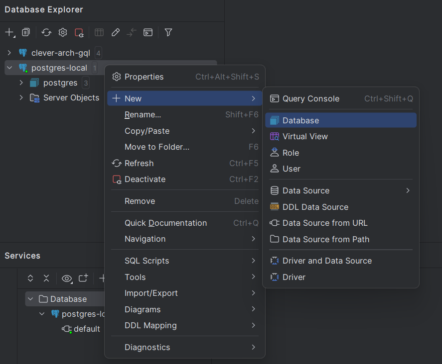

# First Activity
- Node con NestJS
- React con NextJS (próximo laboratorio)

## Objetivos
- Crear un proyecto NestJS desde cero usando GitHub Copilot.
- Usar GHCS para crear un contenedor de Postgres.
- Configurar Nest usando un archivo .env.
- Conectarse a la base de datos.
- Crear un archivo Seeder para poblar la base de datos.
- Crear métodos de actualización y eliminación.
- Crear una mejor descripción de los productos usando Azure Open AI.
- Añadir documentación Swagger.
- Crear un archivo README.md con la documentación del desarrollador del proyecto.
- Exportar el chat a la documentación del desarrollador.
- Crear pruebas unitarias para los servicios (Tarea opcional 🪙).

# Desarrollo Backend

**Requisitos**

- Versión de VS Code
- Docker para Desktop
- Node instalado (nvm opcional)
- GitHub CLI + Extensión de GitHub Copilot habilitada
- Insomnia o Postman o cualquier cliente REST instalado.
- GitHub CLI

## Paso 1: Crear un proyecto NestJS usando GitHub Copilot

```
@workspace /new "crear una aplicación nestjs 9 con una entidad llamada productos, esta entidad tiene 4 atributos, id: string, nombre: string, descripción: string, imagen: string, usando typeorm 0.3.20 para persistencia y adaptador de Postgres"
```

- Selecciona esta carpeta como tu espacio de trabajo para crear el proyecto.
- Instala las dependencias usando `npm install`.

**Comando de GitHub**

```
ghcs "cómo ejecutar un postgres usando docker en mi local"
```

- Ejecuta el comando que ghc sugiere para ejecutar pg localmente.

- Copilot sugerirá un comando para ejecutar un contenedor de postgres en tu máquina local como este:

```bash
docker run --rm --name postgres -e POSTGRES_PASSWORD=mysecretpassword -p 5432:5432 -d postgres:latest
```

## Verificar la conexión a la base de datos

- Usa DBeaver o Datagrip para conectarte al servidor y crear una base de datos llamada `copilot`.



Ve a `app.module.ts`

```
TypeOrmModule.forRoot({
    type: 'postgres',
    host: 'localhost',
    port: 5432,
    username: 'postgres',
    password: 'mysecretpassword',
    database: 'copilot',
    entities: [__dirname + '/**/*.entity{.ts,.js}'],
    synchronize: true,
}),
```

## Verificar si la aplicación se ejecuta correctamente

```bash
npm run start
```

## Solución de problemas

A veces copilot no crea el proyecto con las dependencias correctas, por lo que necesitas instalarlas manualmente.

```bash
npm install @nestjs/typeorm class-validator
```

## Configuración de Nest

- Pregunta en el chat de GitHub Copilot sobre buenas prácticas para no hardcodear las variables de entorno en app.module.ts.

> ¿Podrías sugerir buenas prácticas para no hardcodear las variables de entorno en app.module.ts usando @nestjs/config?

- Copilot sugerirá crear un archivo `.env` en la raíz del proyecto.

```bash
touch .env
```

- Añade el siguiente contenido al archivo `.env`.
- Usa el chat de GH Copilot seleccionando #file:app.module.ts para generar claves que se usarán en el archivo `.env`.

## Paso 2: Conectarse a la base de datos

- Reemplaza las claves en el archivo `.env` con los valores que usamos para ejecutar el contenedor de docker.

## Paso 3: Verificar métodos y hacer modificaciones

- Verifica el servicio de productos y pregunta a copilot cómo añadir soporte para uuid para generar el id del producto.

> ¿Podrías sugerir cómo añadir soporte para uuid para generar el id del producto?

- Copilot sugerirá instalar el paquete `uuid`.

```bash
npm install uuid
```

- Añade el siguiente código al archivo `product.entity.ts`.

```typescript
import { v4 as uuidv4 } from 'uuid';
```

- Añade las modificaciones necesarias para que funcione.

## Paso 4: Crear un archivo Seeder para poblar la base de datos

> Pregunta en el chat de copilot cómo crear un archivo seeder para poblar la base de datos con algunos productos usando @faker-js/faker y onModuleInit.

- Copilot sugerirá instalar el paquete `@faker-js/faker`.

```bash
npm install @faker-js/faker
```

- Crea un archivo `product.seeder.service.ts` en la carpeta `src/seeder`.

```typescript
import { faker } from "@faker-js/faker";
import { Injectable, OnModuleInit } from "@nestjs/common";
import { CreateProductDto } from "./dto/create-product.dto";
import { ProductsService } from "./products.service";

@Injectable()
export class ProductsSeeder implements OnModuleInit {
    constructor(private readonly productsService: ProductsService) {}

    async onModuleInit() {
        await this.seedProducts();
    }

    async seedProducts() {
        for (let i = 0; i < 10; i++) {
            const product: CreateProductDto = {
                name: faker.commerce.productName(),
                description: faker.lorem.sentence(),
                image: faker.image.urlLoremFlickr({
                    category: "products",
                }),
            };
            await this.productsService.create(product);
        }
    }
}
```

- Añade una condición para solo poblar los productos si la tabla está vacía usando Comment Driven Development.
- Usa la sugerencia de copilot y presiona `Ctrl + Enter` para ver todas las sugerencias y aplicar los cambios.

```typescript
        const products = await this.productsService.getProducts();

        if (products.length > 0) {
            return;
        }
```

- Añade el seeder al archivo `products.module.ts`.

```typescript
@Module({
    imports: [TypeOrmModule.forFeature([Product])],
    controllers: [ProductsController],
    providers: [ProductsService, ProductsSeeder],
})
```

- Ejecuta la aplicación y verifica si los productos están siendo poblados en tu cliente de base de datos.

## Paso 5: Crear métodos de actualización y eliminación

- Usando Comment Driven Development, añade la lógica para los métodos de actualización y creación.
- Usando el chat, crea un UpdateProductDto.

> Crea un UpdateProductDto que extienda de #file:create-product.dto.ts y añade id como un atributo.

- Prueba los nuevos métodos usando Insomnia o Postman.

## Paso 6: Crear una mejor descripción de los productos usando Azure Open AI

- Vamos a usar las características de traducción y refactorización de GitHub Copilot para traducir una llamada hecha en python a NodeJS.

```python
import requests

headers = {
        'Content-Type': 'application/json',
        'api-key': 'YOUR_API_KEY',
}

params = {
        'api-version': '2024-08-01-preview',
}

json_data = {
        'messages': [
                {
                        'role': 'system',
                        'content': 'Eres un asistente de IA que ayuda a las personas a crear descripciones de productos.',
                },
                {
                        'role': 'user',
                        'content': 'nike',
                }
        ],
        'max_tokens': 800,
        'temperature': 0.7,
        'frequency_penalty': 0,
        'presence_penalty': 0,
        'top_p': 0.95,
        'stop': None,
}

response = requests.post(
        'https://clever-dev-openai.openai.azure.com/openai/deployments/chat4o/chat/completions',
        params=params,
        headers=headers,
        json=json_data,
)
```

> Usando el chat de copilot, referencia el archivo openai-call.md para traducirlo a código NestJS usando axios para llamar a la API de Azure Open AI.

> Traduce esta implementación #file:openai-call.md a node (nestjs) usando @nestjs/axios.

## Paso 7: Añadir documentación Swagger

- Pregunta a copilot cómo añadir documentación Swagger al proyecto.

> ¿Podrías sugerir cómo añadir documentación Swagger al proyecto?

## Paso 8: Crear un archivo README.md con la documentación del desarrollador del proyecto

- Pregunta a copilot cómo crear un archivo README.md con la documentación del desarrollador del proyecto.

> @workspace "crear un archivo README.md con la documentación del desarrollador del proyecto".

## Paso 9: Exportar el chat a la documentación del desarrollador

- Presiona `Ctrl + Shift + P` y selecciona `Chat: Export Chat`.
- Esto generará un archivo json con todo el historial del chat.
- Intenta exportar el chat en una nueva ventana de VS Code presionando `Ctrl + Shift + P` y selecciona `Chat: Import Chat`.
- Esto generará un nuevo chat con todo el historial, esto ayudará a otros desarrolladores a entender las decisiones tomadas durante el desarrollo.

## Añadir archivo gitignore

- Usa `Ctrl + i` y dile a copilot que cree un archivo gitignore para el proyecto nestjs.

```
# Directorios de dependencias
node_modules/

# Salida de compilación
dist/

# Variables de entorno
.env

# Archivos de IDE
.vscode/
.idea/

# Logs
logs/

# Archivos TypeScript compilados
*.js

# Archivos específicos de Nest.js
.nest/
```

## Paso 10: Crear pruebas unitarias para los servicios (Tarea opcional 🪙)

- Pregunta a copilot cómo añadir soporte para Jest al proyecto.

> ¿Podrías sugerir cómo añadir soporte para Jest al proyecto?

- Copilot sugerirá instalar el paquete `@nestjs/jest`.

```bash
npm install @nestjs/jest
```

- Sigue las instrucciones en la documentación para añadir soporte para Jest al proyecto.
